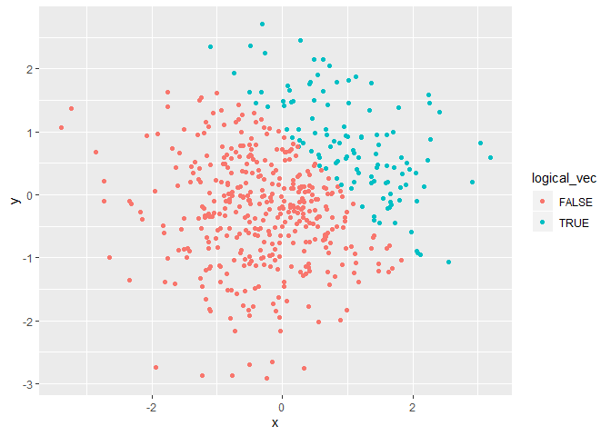
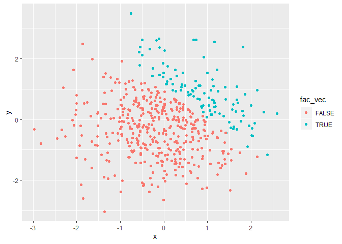

p8105\_hw5\_ilz2105
================
Lulu Zhang
2019-09-17

|               |
| ------------- |
| **Problem 1** |

#### Create a dataframe

Below I created a data frame that has: a random sample of size 8 from a
standard Normal distribution, a logical vector indicating whether
elements of the sample are greater than 0, a character vector of length
8, and a factor vector of length 8, with 3 different factor “levels”.

``` r
# set seed for reproducability
set.seed(1)

## Create data frame
df_1 = tibble(
  ran_samp = rnorm(8),
  log_vec = ran_samp > 0,
  vec_char = c("I", "have", "no", "idea", "what", "Im", "doing" , "yikes"),
  fac_vec = factor(c( "yes", "no", "maybe", "yes", "no", "maybe", "yes", "no"))
)

## Take the mean of each variable in dataframe
mean_samp = mean(pull(df_1, ran_samp))
mean_log = mean(pull(df_1, log_vec))
mean_char = mean(pull(df_1, vec_char))
```

    ## Warning in mean.default(pull(df_1, vec_char)): argument is not numeric or
    ## logical: returning NA

``` r
mean_fac = mean(pull(df_1, fac_vec))
```

    ## Warning in mean.default(pull(df_1, fac_vec)): argument is not numeric or
    ## logical: returning NA

I found the mean for `ran_samp` and `log_vec`, and named them
`mean_samp` and `mean_log`, respectively, but could not get the mean for
`vec_char` and `fac_vec` because they were not numeric or logical
values. The mean for `ran_samp` is 0.1314544, and the mean for
`mean_log` is 0.625. This is possible because `ran_samp` and `log_vec`
are numeric and logical vectors so we can take the mean.

#### Use `as.numeric` for coercion

Below, I applied `as.numeric` to the logical, character, and factor
vectors to coerce into numeric vectors.

``` r
## coerce into numeric vectors 
as.numeric(pull(df_1, vec_char))
as.numeric(pull(df_1, fac_vec))

## convert the logical vector to numeric, and multiply the random sample by the result
as.numeric(pull(df_1, log_vec))*(pull(df_1, ran_samp))

## convert the logical vector to a factor, and multiply the random sample by the result
as.factor(pull(df_1, log_vec))*(pull(df_1, ran_samp))

## convert the logical vector to a factor and then convert the result to numeric, 
## and multiply the random sample by the result

as.numeric(as.factor(pull(df_1, log_vec)))*(pull(df_1, ran_samp))
```

After being converted to numeric, the product of `log_vec`and `ran_samp`
is 0, 0.1836433, 0, 1.5952808, 0.3295078, 0, 0.4874291, 0.7383247. We
cannot mutiply a factor vector because it is not numeric, so trying to
convert `log_vec` to a factor and then multiplying `ran_samp` by the
result did not work. However, we are able to convert `log_vec` to a
factor and then convert that to a numeric vector and multiply that by
`ran_samp` because they are both numeric vectors. The result was
-0.6264538, 0.3672866, -0.8356286, 3.1905616, 0.6590155, -0.8204684,
0.9748581, 1.4766494.

|               |
| ------------- |
| **Problem 2** |

#### Create a dataframe

Below is a data frame comprised of: x, a random sample of size 500 from
a standard Normal distribution, y, a random sample of size 500 from a
standard Normal distribution, a logical vector indicating whether x + y
\> 1, a numeric vector created by coercing the above logical vector, and
a factor vector created by coercing the above logical vector.

``` r
# set seed for reproducability
set.seed(1234)

## create a data frame
df_2 = tibble(
  x = rnorm(500),
  y = rnorm(500),
  logical_vec = x + y > 1,
  num_log = as.numeric(logical_vec),
  fac_vec = as.factor(logical_vec)
)
```

The dataframe created above, `df_2`, has 500 rows and 5 columns The mean
of `x` is 0.0018388. The median of `x` is 0.0018388. The standard
deviation of `x` is 1.0348139. The proportion of cases for which x + y
\> 1 is 0.232

#### Create scatterplots

Below I created a scatterplot of y vs x and colored points using the
logical variable, `logical_vec`. Then, I created a second and third
scatterplot that color points using the numeric and factor variables,
`num_log` and `fac_vec`, respectively.Finally, I exported `plot_1` to my
project directory as a png file.

``` r
## scatterplot with colored points using the logical variable
plot_1 = ggplot(df_2, aes(x, y, color = logical_vec)) + geom_point()

## scatterplot with colored points using the numeric variable
plot_2 = ggplot(df_2, aes(x, y, color = num_log)) + geom_point()

## scatterplot with colored points using the factor variable
plot_3 = ggplot(df_2, aes(x, y, color = fac_vec)) + geom_point()

#view plots
plot_1
```

<!-- -->

``` r
plot_2
```

<!-- -->

``` r
plot_3
```

<!-- -->

``` r
## export first scatterplot to directory
ggsave("plot_1.png")
```

    ## Saving 7 x 5 in image

The color scheme was the same for the scatterplots that colored points
using the logical variable `logical_vec` and the factor variable
`fac_vec` where it was two distinct colors, pink and blue to represent
false and true. The color scheme for the scatterplot that colored points
using the numeric variable `num_log` appeared to be more of a gradient
from blue to black ranging from 0 to 1. However, on the plot, we only
see blue or black which reprent 0 and 1 because we have no values in
between because it was a dichotomous variable.
